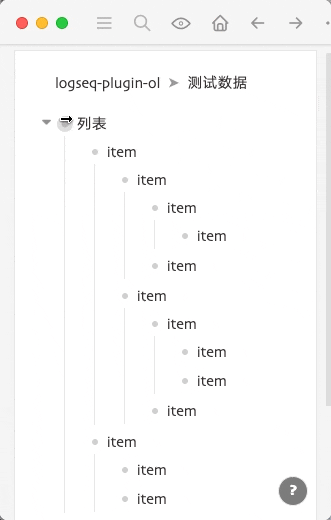

中文 | [English](README.en.md)

# logseq-plugin-ol

有序列表，单级或多级、多种样式的有序列表。

## 使用展示



也可以使用以下两个命令：

- `/Ordered list`
- `/Nested ordered list`
- `/Unordered list`

在想要展示为有序列表的块上添加一个以 `#.ol` 开头的标签就可以了。有多种样式可供选择。

## 序号样式

单级列表

- `#.ol`
- `#.ol-circle`
- `#.ol-paren`
- `#.ol-right-paren`
- `#.ol-dun`

嵌套列表

- `#.ol-nested`
- `#.ol-nested-2`
- `#.ol-nested-3`
- `#.ol-nested-right-paren`
- `#.ol-nested-right-paren-2`
- `#.ol-nested-right-paren-3`

有序列表中的无序列表

- `#.ul`

## 已知问题

- 由于是纯 CSS 解决方案，所以在聚焦进有序列表中的块时，会导致 CSS 样式链断裂，有序列表不能被正确渲染。
- 嵌套列表的嵌套计数器是连续的，也就是说，如果嵌套列表中有单级列表，而单级列表中又有一个嵌套列表的话，这个嵌套列表的层级是从最外层的嵌套列表开始算起的。

## 自定义序号

自定义有序列表符号示例代码：

```css
.ls-block[data-refs-self*='".ol-right-paren']
  > .block-children-container
  > .block-children
  > .ls-block
  > div
  > div
  > a
  + a
  > .bullet-container::before {
  content: counter(kef-ol) ") ";
}

.ls-block[data-refs-self*='".ol-nested-right-paren']
  > .block-children-container
  > .block-children
  > .ls-block
  > div
  > div
  > a
  + a
  > .bullet-container::before,
.ls-block[data-refs-self*='".ol-nested-right-paren']
  .ls-block
  > div
  > div
  > a
  + a
  > .bullet-container::before {
  content: counters(kef-ol-nested, ".") ") ";
}
```

第一段对应普通列表，.ol-right-paren 部分可以改为任何以.ol-开头的 tag，例如：.ol-my；content 里面的双引号里的内容就是序号采用的符号，你可以按照喜好修改。

第二段对应嵌套列表，修改方法同第一段。

## Buy me a coffee

如果您认为我所开发的软件对您有所帮助，并且愿意给予肯定和支持，不妨扫描下方的二维码进行打赏。感谢您的支持与关注。

 
